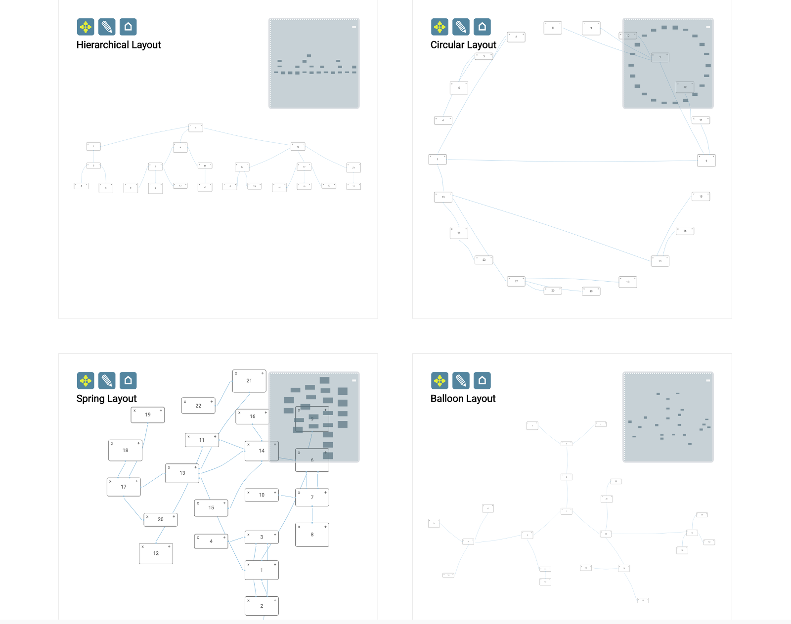

<a id="top"></a>
## Multiple Renderers

This is an example of how the Toolkit supports multiple renderers for one dataset. A single instance of the Toolkit is maintained,
rendering to four different Surface widgets, each of which has a different layout. Operations in one renderer affect the dataset and cause updates in all renderers.



- [package.json](#package)
- [Page Setup](#setup)
- [Templates](#templates)
- [Data Loading](#loading)
- [View](#view)
- [Rendering](#rendering)
- [Selecting Nodes](#selecting)
- [Adding New Nodes](#adding)
- [Deleting Nodes](#deleting)


<a id="package"></a>
### package.json

```javascript
{
    "dependencies": {
        "font-awesome": "^4.7.0",
        "jsplumbtoolkit": "file:../../jsplumbtoolkit.tgz"
    }
}

```

[TOP](#top)

---

<a id="setup"></a>
### Page Setup

#### CSS

```xml
<link href="node_modules/font-awesome/css/font-awesome.min.css" rel="stylesheet">
<link rel="stylesheet" href="node_modules/jsplumbtoolkit/dist/css/jsplumbtoolkit-defaults.css">
<link rel="stylesheet" href="node_modules/jsplumbtoolkit/dist/css/jsplumbtoolkit-demo.css">
<link rel="stylesheet" href="app.css">
```
Font Awesome, `jsplumbtoolkit-demo.css`, and `app.css` are used for this demo and are not jsPlumb Toolkit requirements. `jsplumbtoolkit-defaults.css` is recommended for all apps using the Toolkit, at least when you first start to build your app. This stylesheet contains sane defaults for the various widgets in the Toolkit. 

#### JS

```xml
<script src="node_modules/jsplumbtoolkit/dist/js/jsplumbtoolkit.js"></script>
<script src="demo-support.js"></script>
<script src="app.js"></script>
```

We import `jsplumbtoolkit.js` from `node_modules` (it was listed in `package.json`). `demo-support.js` is used to generate random data sets for the demo. `app.js` contains the demo code; it is
discussed on this page.

[TOP](#top)

---

<a id="templates"></a>
### Templates

This demonstration uses a single template to render its nodes across all renderers:

```xml
<script type="jtk" id="tmplNode">
  <div style="width:${w}px;height:${h}px;">
    <div class="name">
      <div class="delete" title="Click to delete">
        <i class="fa fa-times"></i>
      </div>
      <span>${name}</span>
      <div class="add" title="Add child node">
        <i class="fa fa-plus"></i>
      </div>
    </div>
  </div>
</script>
```

[TOP](#top)

---

<a id="loading"></a>
### Data Loading

Data for the demonstration is created using the `randomHierarchy` function from the included `demo-support.js` file. This function creates an arbitrary hierarchy and assigns different widths/heights to the various nodes.

The data is generated like this:

```javascript
// make a random hierarchy
var hierarchy = jsPlumbToolkitDemoSupport.randomHierarchy(3, 3);
```

And loaded via this call at the bottom of `app.js`:

```javascript
toolkit.load({data: hierarchy});
```

[TOP](#top)

---

<a id="view"></a>
### View

This demonstration has a very simple view:

```javascript
var view = {
  nodes: {
    "default": {
      template: "tmplNode"
    }
  }
};
```

[TOP](#top)

---

<a id="rendering"></a>
### Rendering

The render parameters for this demonstration are broken up into two parts - common parameters, shared by all renderers, and then renderer-specific parameters (which are, in this case, just layout parameters, but could be anything).

###### Common Render Parameters

```javascript
var jsPlumbOptions = {
    Anchor:"Continuous",
    Connector: [ "StateMachine", { curviness: 10 } ],
    DragOptions: { cursor: "pointer", zIndex: 2000 },
    PaintStyle: { lineWidth: 1, strokeStyle: "#89bcde" },
    HoverPaintStyle: { strokeStyle: "#FF6600", lineWidth: 3 },
    Endpoints: [
        [ "Dot", { radius: 2 } ],
        [ "Dot", { radius: 2 } ]
    ],
    EndpointStyle: { fillStyle: "#89bcde" },
    EndpointHoverStyle: { fillStyle: "#FF6600" }
};

var commonParameters = {
  view: view,
  jsPlumb: jsPlumbOptions,
  zoomToFit: true,
  lassoFilter: ".controls, .controls *, .miniview, .miniview *",
  events: {
    canvasClick: function () {
      toolkit.clearSelection();
    }
  },
  consumeRightClick: false
};
```

Here's an explanation of what the various common parameters mean:

- **view**

These are the Node, Port and Edge definitions.

- **consumeRightClick**

This is something you'll find useful when developing: the default behaviour of the Surface widget is to consume 
right-clicks.

- **lassoFilter**

This selector specifies elements on which a mousedown should not cause the selection lasso to begin. In this 
demonstration we exclude the buttons in the top left and the miniview. 

- **events**

We listen for the `canvasClick` event on the Surface: a click somewhere on the widget's whitespace. Then we clear 
the Toolkit's current selection.

- **jsPlumb**

Recall that the Surface widget is backed by an instance of jsPlumb. This parameter sets the 
[Defaults](/community/doc/defaults.html) for that object.  

- **zoomToFit**

When true, this parameter instructs a Surface widget to zoom the content so that it is all visible, both when the 
widget is first constructed (to cover the case that there is data already in the Toolkit) and also whenever new data is loaded via the `load` method on the Toolkit instance.

###### Renderer Specific Parameters

There are three things that are different for each renderer:

- the ID of the element to use as the Surface container
- the ID of the element to use as the miniview
- the layout parameters.

All of this information is stored (indirectly, in the case of the element IDs) in the `rendererSpecs` object:

```javascript
var rendererSpecs = {
  "hierarchical":{
    type: "Hierarchical",
    parameters: {
      orientation: "horizontal",
      padding: [60, 60]
    }
  },
  "circular":{
      type: "Circular",
      parameters: {
        padding: 30
      }
  },
  "spring":{
    type:"Spring"
  },
  "balloon":{
    type:"Balloon"
  }
};
```

These are processed in the following way:

```javascript
var render = function(id, layoutParams) {
  var selector = "#demo-" + id;
  var r = toolkit.render({
    container: "demo-" + id,
    layout: layoutParams,
    miniview: {
      container: "miniview-" + id
    },
    events:{
      "modeChanged" :function (mode) {
        jsPlumb.removeClass(jsPlumb.getSelector(selector + " [mode]"), "selected-mode");
        jsPlumb.addClass(jsPlumb.getSelector(selector + " [mode='" + mode + "']"), "selected-mode");
      }
    }
  }, commonParameters);

  // bind event listeners to the mode buttons
  jsPlumb.on(selector, "click", "[mode]", function () {
    r.setMode(this.getAttribute("mode"));
  });

  // on home button click, zoom content to fit.
  jsPlumb.on(selector, "click", "[reset]", function () {
    toolkit.clearSelection();
    r.zoomToFit();
  });
};

// render each one
for (var id in rendererSpecs)
  render(id, rendererSpecs[id]);

```

To explain each parameter:

- **container** This is the ID of the element into which to render
- **layout** These are the layout parameters for the specific renderer
- **miniview** Specs for the miniview. In this demonstration we provide only the ID of the element to turn into a miniview.
- **events** In this section we wire up the Surface's `modeChanged` event to some code that maintains the state of the buttons that appear in the top left corner of the canvas.

```javascript
"modeChanged" :function (mode) {
  jsPlumb.removeClass(jsPlumb.getSelector(selector + " [mode]"), "selected-mode");
  jsPlumb.addClass(jsPlumb.getSelector(selector + " [mode='" + mode + "']"), "selected-mode");
}
```

Using jsPlumb to add/remove classes or get an appropriate selector is not necessary if you have some other library (such as jQuery) in your page. The Toolkit uses these methods because it does not need jQuery. Any library that returns a list-like object for a selector is appropriate to use here.

- **commonParameters**  The `render` method takes an optional second argument, for use cases such as this, in which you want to share some parameters between several render calls.

The renderer is assign to the variable **r**.  We then bind two click listeners to it:

```javascript
jsPlumb.on(selector, "click", "[mode]", function () {
  r.setMode(this.getAttribute("mode"));
});

// on home button click, zoom content to fit.
jsPlumb.on(selector, "click", "[reset]", function () {
  toolkit.clearSelection();
  r.zoomToFit();
});
```

The first of these extracts the desired mode from the button that was clicked and sets it on the renderer; this causes the `modeChanged` event to be fired, which is picked up by the code we discussed above.

The second click listener here is used to clear the current selection and reset the renderer to the state in which all of the content is visible.

[TOP](#top)

---


<a id="selecting"></a>
### Selecting nodes

Lasso selection is enabled by default on the Surface widget. To activate the lasso, click the pencil icon in the toolbar:


The code that listens to clicks on this icon discussed above in the section about [rendering](#rendering).


#### Lasso Operation

The lasso works in two ways: when you drag from left to right, any node that intersects your lasso will be selected.  When you drag from right to left, only nodes that are enclosed by your lasso will be selected.


#### Exiting Select Mode

The Surface widget automatically exits select mode once the user has selected something. In this application we also listen to clicks on the whitespace in the widget and switch back to pan mode when we detect one. This is the `events` argument to the `render` call:

```javascript
events: {
  canvasClick: function (e) {
    toolkit.clearSelection();
  }
}
```

`clearSelection` clears the current selection and switches back to Pan mode.

[TOP](#top)

---

<a id="adding"></a>
### Adding New Nodes

Each node in this demonstration has two buttons:


Clicking on the **+** button causes a new node to be added as a child of the current Node. Here's the code that sets up the listener and adds the child. Note the use of the `batch` function to suspend repainting until all the model operations are completed - this is required by the [Spring layout](https://docs.jsplumbtoolkit.com/toolkit/current/articles/demo-spring); without it, the layout would repaint before the edge existed and the new node would not necessarily be positioned near the node that was clicked on:

```javascript
jsPlumb.on(document, "click", ".add *", function (e) {
  // this helper method can retrieve the associated
  // toolkit information from any DOM element.
  var info = toolkit.getObjectInfo(this);
  // get a random node.
  var n = jsPlumbToolkitDemoSupport.randomNode();
  // wrap the node and edge addition in a batch, because the spring layout prefers that all
  // data operations be completed before a refresh of the layout.
  toolkit.batch(function() {
    // add the node to the toolkit
    var newNode = toolkit.addNode(n);
    // and add an edge for it from the current node.
    toolkit.addEdge({source: info.obj, target: newNode});
  });
});
```

[TOP](#top)

---

<a id="deleting"></a>
### Deleting Nodes

Clicking the delete button in this demonstration deletes not just the current node, but also all of its descendants.  This is done by creating a [Selection](https://docs.jsplumbtoolkit.com/toolkit/current/articles/selections#descendantSelection) and then instructing the Toolkit to remove everything in that Selection:

```javascript
jsPlumb.on(document, "click", ".remove *", function (e) {
  var info = toolkit.getObjectInfo(this);
  var selection = toolkit.selectDescendants(info.obj, true);
  toolkit.remove(selection);
});
```

[TOP](#top)
